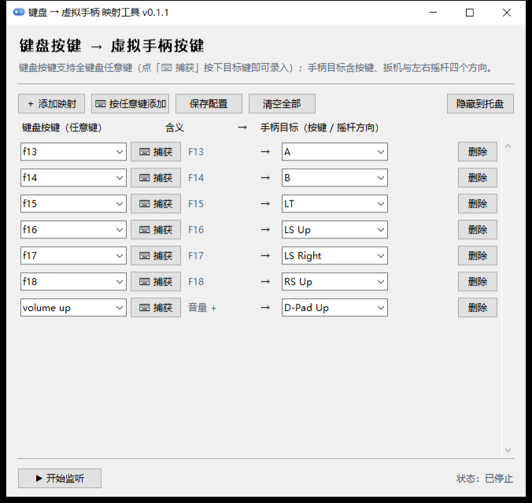
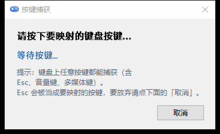

# KbdToPad · Keyboard → Virtual Gamepad Mapper

[简体中文](README.md) ｜ **English**

Maps keyboard keys — especially the extra buttons of Windows handhelds such as `F13`–`F24` — to the
buttons, triggers and **left/right stick directions** of a **virtual Xbox 360 gamepad**, so games
without custom-key support can still use the extra buttons on your handheld.


> Author: [@Ruozes](https://github.com/Ruozes) ｜ This project (code, documentation and UI copy) was
> built with the assistance of [DeepSeek](https://www.deepseek.com/) — see [Acknowledgements](#acknowledgements).

## Contents

* [Features](#features)
* [Screenshots](#screenshots)
* [Requirements](#requirements)
* [Download and install](#download-and-install)
* [Run from source](#run-from-source)
* [Usage](#usage)
* [Config and log locations](#config-and-log-locations)
* [Command-line options](#command-line-options)
* [Building the exe and installer](#building-the-exe-and-installer)
* [Project layout](#project-layout)
* [FAQ](#faq)
* [Disclaimer](#disclaimer)
* [Contributing](#contributing)
* [Acknowledgements](#acknowledgements)
* [License](#license)

## Features

* **Any key on the keyboard can be mapped**:
  * Every mapping row has a “⌨ Capture” button: press the key you want and it is recorded (`Esc`,
    volume keys and multimedia keys can all be captured);
  * The key-name field ships with a list of common key names that filters as you type, and you can also
    type a name by hand (e.g. `f13`, `volume up`);
  * Key-name case and common aliases are normalised automatically (`ESCAPE` → `esc`, `PrtScn` →
    `print screen`), and the “Meaning” column shows a friendly name for the key;
  * Before listening starts the mapping table is validated: unrecognised key names are reported and
    skipped, and duplicate mappings ask for confirmation.
* **Gamepad side covers buttons, triggers and sticks**: `A/B/X/Y`, `LB/RB`, `LT/RT`, `Back/Start`,
  `LS/RS`, the D-pad, and **four directions for each of the left and right sticks** (held = full value
  ±32767, released = centred; holding two directions at once gives a diagonal).
* **Lives in the system tray**: the tray icon has two states — “listening” (bright blue body with a
  green indicator lamp at the lower right) and “stopped” (grey-blue, no lamp) — so the current state is
  obvious at a glance. Clicking × only hides the window to the tray instead of quitting. The tray menu
  offers “Show main window / Status / Start listening (checkable) / Open data folder / Quit”.
* **Start with Windows** (optional during setup): launches silently into the tray and starts listening.
* The mapping table can be edited at any time and saved with a single click; it is loaded again on the
  next start. Configuration and logs are kept in `%APPDATA%\KbdToPad`.
* Runs as a single instance (named mutex). Stopping listening or quitting resets every button, trigger
  and stick so the gamepad never gets “stuck”.

## Screenshots

Main window (key names can be captured or picked from a list; the right-hand column holds the gamepad
targets, including stick directions):



After clicking “⌨ Capture”, press any key you want to map:



## Requirements

| Item | Requirement |
| --- | --- |
| OS | Windows 10 / 11 x64 (handhelds and desktops both work) |
| Driver | [ViGEmBus](https://github.com/nefarius/ViGEmBus/releases) (provides the virtual gamepad; the installer detects and installs it automatically) |
| Runtime | Microsoft Visual C++ 2015-2022 x64 (the DLL shipped with vgamepad depends on it; the installer adds it when missing) |
| Privileges | Administrator rights are required to capture keys from a game in the foreground; the exe embeds a UAC elevation manifest |

## Download and install

1. Open [Releases](https://github.com/Ruozes/KbdToPad/releases/latest) and download
   `KbdToPad-Setup-0.1.1.exe` (about 39.5 MB — **the ViGEmBus driver and the VC++ runtime are bundled
   inside**);
2. Run it (it asks for administrator rights). You can choose to create a desktop shortcut and to start
   the app with Windows;
3. Once installed, launch the app → add a mapping → click “▶ Start listening”. Pressing the mapped key
   now acts as pressing the gamepad button.

The installer extracts the program to `%ProgramFiles%\KbdToPad`, silently installs ViGEmBus / the VC++
runtime when they are missing, and on uninstall stops the process, removes the program and its
uninstall entry, and asks whether to delete your configuration and logs as well.

> **Portable use**: copy the whole install folder (by default `C:\Program Files\KbdToPad`) anywhere you
> like — but you have to install the ViGEmBus driver yourself. Running from source works too; see the
> next section.

## Run from source

```powershell
git clone https://github.com/Ruozes/KbdToPad.git
cd KbdToPad
pip install -r requirements.txt
python kbd_to_pad.py            # normal start
python kbd_to_pad.py --tray     # start hidden in the system tray
```

Install the [ViGEmBus driver](https://github.com/nefarius/ViGEmBus/releases) first. The `keyboard`
library needs administrator rights to capture keys from a game in the foreground, so run it elevated
(the packaged exe requests elevation on its own).

## Usage

1. Use your handheld vendor's tool (e.g. the AYANEO button settings) to map the handheld's extra
   button to a keyboard key. Sticking to rarely used keys such as `F13`–`F24` is the safest choice;
2. Open KbdToPad and click “＋ Add mapping” to add a row (or click “⌨ Add by pressing any key” to jump
   straight into capture):
   * **Left column (key)**: click “⌨ Capture” on that row and press the keyboard key you want to map
     (any key works, `Esc` is accepted as a normal key — use the dialog's “Cancel” to abort). You can
     also pick from the drop-down list (typing filters it) or type the key name by hand;
   * **Right column (target)**: pick the gamepad target from the drop-down list; besides the regular
     buttons it also offers `LT`/`RT` and the eight stick directions;
3. Add as many rows as you need, then click “Save configuration” to write them to disk (they are loaded
   automatically on the next start);
4. Click “▶ Start listening”; the status turns green and the mapping is live — pressing that keyboard
   key now presses the corresponding gamepad button / pushes the stick in the game;
5. Clicking × in the top-right corner **hides the window to the system tray** (it does not quit). A
   bright blue tray icon with a green lamp means listening is on; grey-blue means it is stopped. The
   tray menu offers “Show main window / Start listening (checkable) / Open data folder / Quit”.

Gamepad targets and their behaviour:

| Target | Behaviour |
| --- | --- |
| `A` `B` `X` `Y` `LB` `RB` `Back` `Start` `LS` `RS` `D-Pad Up/Down/Left/Right` | Presses / releases the corresponding gamepad button |
| `LT` / `RT` | Full value (255) while held, 0 when released |
| `LS Up` / `LS Down` / `LS Left` / `LS Right` | Pushes the left stick to the full value in that direction (±32767), back to centre (0) when released |
| `RS Up` / `RS Down` / `RS Left` / `RS Right` | Same for the right stick |

> Stick directions are digital rather than analogue: held = full value, released = centred. To get a
> diagonal, map two perpendicular directions to two different keys (for example `f15` → `LS Up` and
> `f16` → `LS Right`) and hold both at the same time. If both directions of the same axis are held at
> once, the positive direction wins.

About key names: the keyboard side uses the canonical lower-case key names of the
[`keyboard`](https://github.com/boppreh/keyboard) library (`esc`, `print screen`, `volume up`,
`left shift`, …). Case and common aliases are normalised automatically and the “Meaning” column shows a
friendly name. Key names that cannot be recognised are reported and skipped before listening starts.

### Example configuration

`%APPDATA%\KbdToPad\config.json`:

```json
[
  { "key": "f13", "button": "A" },
  { "key": "f14", "button": "LT" },
  { "key": "f15", "button": "LS Up" },
  { "key": "f16", "button": "LS Right" },
  { "key": "f17", "button": "RS Up" }
]
```

Holding `f15` + `f16` at the same time gives a **diagonal up-left** on the left stick. Both the old
field `button` and the new field `target` are accepted.

## Config and log locations

| Content | Path |
| --- | --- |
| Configuration | `%APPDATA%\KbdToPad\config.json` |
| Log | `%APPDATA%\KbdToPad\app.log` (rotated to `app.log.1` once it exceeds 256 KB) |

> The installed (packaged) build uses the paths above. When you **run the source directly**, the
> configuration and log are placed next to the script (the project root) to make debugging easier. Older
> versions kept `config.json` beside the exe; the first run of a newer version migrates it once. Tray
> menu → “Open data folder” opens that folder directly — attach `app.log` to your issue when reporting
> problems.

## Command-line options

| Option | Description |
| --- | --- |
| `--tray` | Start hidden in the system tray |
| `--listen` | Start listening immediately |
| `--version` | Print the version and exit |

Only one instance can run at a time (named mutex `Local\KbdToPad_SingleInstance`); launching again
brings the existing window to the front.

## Building the exe and installer

`build.py` takes care of: generating the icons and the exe version resource → packaging the exe with
PyInstaller → downloading the driver / runtime that ship with the installer → compiling the installer:

```powershell
pip install -r requirements-dev.txt
winget install -e --id JRSoftware.InnoSetup   # requires Inno Setup 6 (the installer step is skipped when it is missing)
python build.py                # default: folder build exe + installer (recommended)
python build.py --onefile      # single-file exe + installer
python build.py --no-installer # exe only
python build.py --icons-only   # only regenerate the icons under assets\
```

Outputs (the version number in the file names comes from `app_info.py`):

```text
dist\KbdToPad\KbdToPad.exe                     folder build exe (default; starts faster)
dist\KbdToPad.exe                              single-file exe (with --onefile)
installer\Output\KbdToPad-Setup-0.1.1.exe      installer (~39.5 MB, measured)
```

The driver / runtime bundled into the installer are downloaded by `build.py` into `installer\vendor\`
(skipped when they are already there, and not tracked by git):

| File | Purpose |
| --- | --- |
| `installer\vendor\ViGEmBusSetup.exe` | [ViGEmBus](https://github.com/nefarius/ViGEmBus) (BSD-3-Clause) virtual gamepad driver; silently installed by the setup when missing |
| `installer\vendor\VC_redist.x64.exe` | Microsoft VC++ 2015-2022 runtime, required by the DLL shipped with vgamepad |
| `installer\vendor\ChineseSimplified.isl` | Inno Setup Simplified Chinese language file (the setup falls back to English when it cannot be fetched) |

The download is done by `build.py` (`--no-download` skips it entirely, `--skip-vcredist` skips only the
runtime). None of these files are needed for plain development or debugging.

> CI is available as well: the repository ships the GitHub Actions workflow
> [`.github/workflows/build.yml`](.github/workflows/build.yml). Triggering it manually on the
> **Actions** page builds the project and uploads the exe (artifact `KbdToPad-exe`) and the installer
> (artifact `KbdToPad-installer`); pushing a `v*` tag additionally creates a draft Release with the
> installer attached. The release procedure is documented in [`docs/RELEASING.md`](docs/RELEASING.md).

## Project layout

```text
KbdToPad/
├─ kbd_to_pad.py            main program (GUI, key capture, virtual gamepad mapping, system tray)
├─ app_info.py              app name / version / author metadata (shared by the build and the installer)
├─ icon_art.py              program icon drawing code (the tray icon is generated by it as well)
├─ build.py                 one-shot build script (icons → PyInstaller → Inno Setup)
├─ KbdToPad.spec            PyInstaller build configuration
├─ requirements.txt         runtime dependencies
├─ requirements-dev.txt     packaging / development dependencies
├─ assets\                  icon resources (app.ico / app.png / tray icons, generated by build.py)
├─ installer\
│  ├─ KbdToPad.iss         Inno Setup installer script (Chinese UI)
│  └─ vendor\              ViGEmBus driver / VC++ runtime / Chinese language file (auto-downloaded, not tracked)
├─ tools\
│  ├─ make_icon.py         regenerate the icons under assets\ on their own
│  └─ make_screenshot.py   regenerate the screenshots under docs\
├─ docs\                   README screenshots and the release guide (RELEASING.md)
└─ .github\workflows\      GitHub Actions build workflow
```

## FAQ

**Q: Nothing happens after I start listening?**
First make sure the tool **runs with administrator rights** (the `keyboard` library cannot capture keys
from a game in the foreground otherwise; the installed build elevates itself). Then check that the
ViGEmBus driver is installed (a ViGEmBus device appears in Device Manager). Finally open an online
gamepad tester such as <https://hardwaretester.com/gamepad> and confirm that the virtual gamepad
produces input. If the status bar reports an unrecognised key name, that row's key name is invalid —
record it again with “⌨ Capture”.

**Q: A certain keyboard key cannot be captured?**
Handheld extra buttons have to be mapped to a keyboard key in the vendor's software first. If a key is
grabbed by the system or the vendor tool (some function keys trigger an on-screen display directly),
Windows never passes it to the program — use a free key such as `F13`–`F24` instead.

**Q: The stick is always at full speed / diagonals are hard to press?**
Stick directions are digital (full value / centred). For a diagonal, map two perpendicular directions
to two keys and hold both at once.

**Q: Can I map to several gamepads, or remap the keyboard and mouse?**
Currently exactly one virtual Xbox 360 gamepad is created (XInput slot 1), and keyboard/mouse
remapping is out of scope.

**Q: Antivirus flags the exe / a game's anti-cheat complains?**
The exe is packaged with PyInstaller and is easily flagged by heuristics (especially the single-file
`--onefile` build; you can always build from source yourself). Anti-cheat systems (EAC, BattlEye, …)
each treat virtual gamepads differently — check the rules of the game you are playing; any
consequences are your own responsibility.

**Q: Does the installer install drivers?**
Yes. When ViGEmBus or the VC++ runtime is missing, the setup installs them silently. The uninstaller
does not remove those two system components (other software may rely on them).

**Q: The UI looks blurry on multi-monitor / high-DPI setups?**
The interface is already DPI-aware. If it still looks wrong, adjust it via the exe's properties →
Compatibility → Change high DPI settings.

## Disclaimer

* This software is provided **“as is”**, without warranty of any kind; any problems caused by using it
  are the user's own responsibility.
* Input mapping is global: while listening, the mapped keys are replaced by gamepad input and may
  affect other applications in the foreground — evaluate that yourself.
* Respect the terms of service and anti-cheat rules of the games and platforms you use. Do not use this
  software to cheat or to bypass detection, and do not use it for anything unlawful.
* This project is not affiliated with AYANEO, GPD, Valve or any other hardware vendor; third-party
  names in the screenshots are used for illustration only.

## Contributing

* Please report problems in [Issues](https://github.com/Ruozes/KbdToPad/issues) and include your
  Windows version, handheld model, reproduction steps and `%APPDATA%\KbdToPad\app.log`.
* Before submitting code, keep the existing style (Chinese comments, `standard library → third-party`
  import order) and make sure both
  `python -m py_compile kbd_to_pad.py app_info.py icon_art.py` and `python build.py --no-installer`
  succeed.
* If you add a gamepad target, update the “Usage” table in both README files and `CHANGELOG.md`.

## Acknowledgements

* **This project was built with the assistance of [DeepSeek](https://www.deepseek.com/)**: the UI
  layout, the key-capture and virtual-gamepad mapping implementation, the Inno Setup installer script
  and the documentation (README / CHANGELOG) were written and verified item by item through many rounds
  of collaboration with DeepSeek. Author and maintainer: [**@Ruozes**](https://github.com/Ruozes).
* Thanks to [ViGEmBus](https://github.com/nefarius/ViGEmBus) for the virtual gamepad driver, and to the
  open-source projects [vgamepad](https://github.com/yannbouteiller/vgamepad),
  [keyboard](https://github.com/boppreh/keyboard), [pystray](https://github.com/moses-palmer/pystray)
  and [Pillow](https://python-pillow.org/).

## License

This project is released under the [MIT License](LICENSE). Third-party components and drivers are
listed in [`THIRD_PARTY_NOTICES.md`](THIRD_PARTY_NOTICES.md):
[vgamepad](https://github.com/yannbouteiller/vgamepad) (MIT),
[keyboard](https://github.com/boppreh/keyboard) (MIT),
[pystray](https://github.com/moses-palmer/pystray) (LGPLv3),
[Pillow](https://python-pillow.org/) (MIT-CMU),
[ViGEmBus](https://github.com/nefarius/ViGEmBus) (BSD-3-Clause),
[pyinstaller](https://pyinstaller.org/) (GPL-2.0-with-exception, build tool only — it affects the
generated exe only).

## Changelog

See [`CHANGELOG.md`](CHANGELOG.md) for the changes in every version; the current version is **v0.1.1**.
